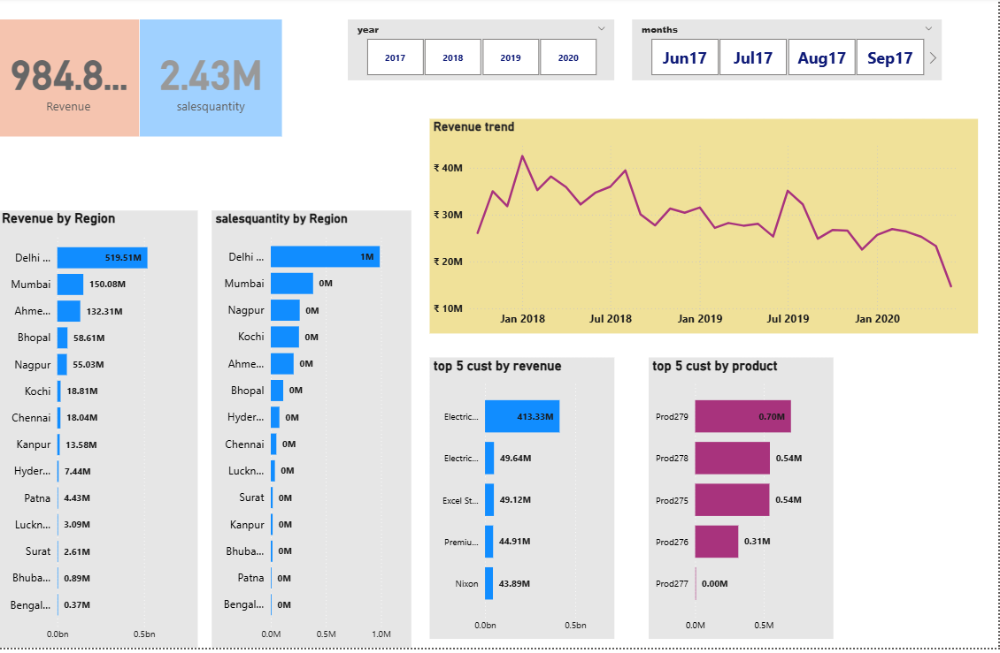

# 📊 Sales Insight Dashboard

This repository contains a Power BI dashboard that analyzes historical sales data stored in MySQL Server. The dashboard allows users to explore revenue trends, regional performance, and top customers using interactive filters and clear visualizations.

## Features

- Revenue and sales quantity by region
- Monthly and yearly revenue trends
- Top customers by revenue and product
- Dynamic filtering by year and month

## Tech Stack

- Power BI Desktop
- MySQL Server
- SQL

## Preview

## How to Use

Download the `.pbix` file and open it in Power BI Desktop to explore the visuals.
